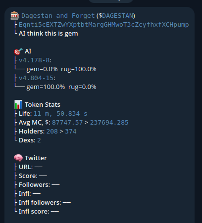
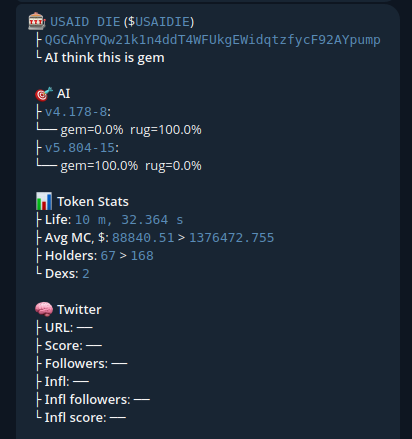

# [Research] Meme-tokens AI predictions

## Prerequisite
The question was raised whether it is possible to predict the likelihood of scams in meme tokens on Solana at an early stage using AI. A lightweight build was created that provided approximately 100 input neurons for the neural network. Several hundred tokens were analyzed, and an AI was trained.

We managed to train a lightweight AI model to classify a token as either a Rug or a Gem. Rug - too dangerous to buy, Gem - can be bought and sold in the near future with minimal risk.

Such a model requires constant updates and training on current data.

## Research Stages
1. Client orientation
2. Predictive capability
3. How and where to deliver information for the fastest possible delivery to users

## Client Orientation
The main clients are people who are immersed in trading meme tokens and need an additional tool for early-stage analysis of meme token launches. There are many Telegram channels where people collectively discuss the purchase of various meme tokens at early stages.

## Predictive Capability
The lightweight version of the AI model had about 100 input neurons, which made the model very categorical, and it started to make mistakes immediately when the trend changed.

## Information Delivery Used Telegram
A Telegram bot was created that immediately sent information about a token if the token exceeded 70% in the prediction for the Gem class.

- Max Cap in $ after launch = **900k**$
- Cap in $ at call to buy = **250k**$

- Max Cap in $ after launch = **5kk** $
- Cap in $ at call to buy = **1.4kk** $

## Conclusion
By inputting a greater number of neurons and a larger amount of data, as well as timely (automatic) updates of the AI model, a powerful utility for buying/selling meme tokens can be achieved.

As proof: the screenshots show versions of the AI model in the following format: `${version}.{badDataCounts}-${goodDataCounts}`;
where the version indicates an increase in the number of input neurons, and badDataCount and goodDataCount represent the training data, negative and positive respectively.

After the research, it was decided that more data about tokens needs to be collected, for which [github.com/und3rd0gz/defiKit](https://github.com/und3rd0gz/defiKit) was created, which will be scaled in the future. Currently, more than 1000 input neurons are being collected.
