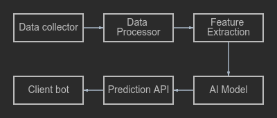

# Tech-doc Meme-token AI predictions

# System Overview
The meme-token prediction system is a multi-component solution built on the Node.js/TypeScript stack using TensorFlow.js for machine learning. The system is designed to analyze new meme tokens on the Solana blockchain (initially, only Solana is supported) within the first 15 minutes after their launch, providing users with the following metrics:
- Probability of a scam (in percentage)
- Forecast of maximum market capitalization
- Optimal time to buy
- Optimal time to sell

# System Architecture

The meme-token prediction system consists of several key components, each performing its unique role in the process of data collection, processing, and analysis. Below is a description of each component and the tools used:
## Data Collector
**Description:**
The Data Collector is responsible for gathering data on new meme tokens from the blockchain. It uses APIs to interact with the blockchain and extract the necessary data.
**Tools:**
- [github.com/und3rd0gz/defiKit](https://github.com/und3rd0gz/defiKit)

## Data Processor
**Description:**
The Data Processor processes and normalizes the collected data, preparing it for further analysis.

## Feature Extraction
**Description:**
This component extracts features from the processed data that will be used for training the machine learning model.

## AI Model
**Description:**
The AI Model is a trained machine learning model that analyzes the extracted features and makes predictions about meme tokens.
**Tools:**
- **TensorFlow.js:** For creating and training the machine learning model.

## Prediction API
**Description:**
The Prediction API provides an interface for interacting with the model and obtaining predictions.

## Client Bot
**Description:**
The Client Bot interacts with users, providing them with predictions and notifications about new meme tokens.

This architecture ensures efficient data collection, processing, and analysis, allowing users to receive timely and accurate predictions about meme tokens.
